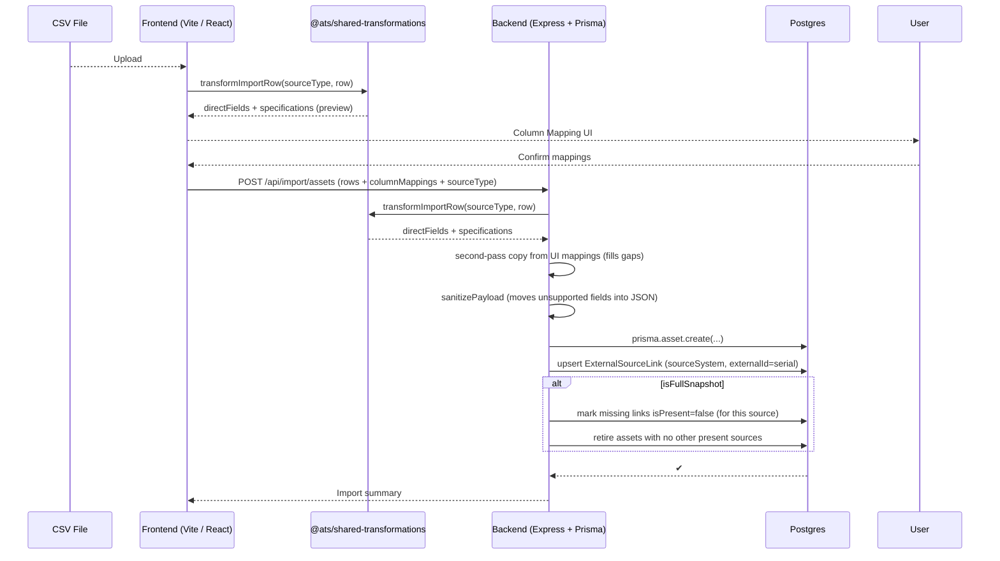

# Refactored Import Architecture (2025-07-25)

> **TL;DR**  All import logic now lives in a _single shared package_ and every import source has its own isolated rules.  The backend, frontend and tests consume the **exact same code** so there is no duplication and no risk of drift.

---

## 1. High-level Flow



---

## 2. Directory Structure

```
packages/
  shared/                         # @ats/shared-transformations
    src/
      importTransformations.ts    # generic helpers (simplifyRam, aggregateVolumes…)
      importSources/
        telusTransforms.ts        # Telus phone CSV rules
        ninjaOneTransforms.ts     # NinjaOne RMM rules (computers)
        bgcTemplateTransforms.ts  # Internal Excel template rules
        transformationRegistry.ts # central registry used everywhere
  backend/
    src/routes/import.ts          # bulk-import route – calls shared transformer
  frontend/
    src/components/ColumnMapper.tsx  # mapping UI – uses shared getImportMappings
```

---

## 3. Source-specific Modules

Example (`ninjaOneTransforms.ts`):
```ts
export const NINJA_ONE_MAPPINGS: ColumnMapping[] = [
  { ninjaColumn: 'Manufacturer',   targetField: 'make',             targetType: 'direct' },
  { ninjaColumn: 'System Model',   targetField: 'model',            targetType: 'direct' },
  { ninjaColumn: 'OS Name',        targetField: 'operatingSystem',  targetType: 'specifications' },
  { ninjaColumn: 'OS Architecture',targetField: 'osArchitecture',   targetType: 'specifications' },
  { ninjaColumn: 'OS Build Number',targetField: 'osBuildNumber',    targetType: 'specifications' },
  { ninjaColumn: 'RAM',            targetField: 'ram',              targetType: 'specifications', processor: simplifyRam },
  { ninjaColumn: 'Volumes',        targetField: 'storage',          targetType: 'specifications', processor: aggregateVolumes },
  // …more
];
```

## 4. Presence Tracking & Preview

- ExternalSourceLink table records per-source presence via `firstSeenAt`, `lastSeenAt`, and `isPresent`.
- Import supports full vs partial snapshots (UI toggle). Only full snapshots trigger retire sweep.
- Preview endpoint (`POST /api/import/preview`) returns:
  - `willRetire`: assets present previously in the source but not included this run
  - `willReactivate`: retired assets that will reappear based on incoming serials
- Overrides:
  - `retireSkipAssetIds[]`: skip retiring these asset IDs
  - `reactivationAllowSerials[]`: only these serials will be reactivated; others remain RETIRED

Each module exports:
* `MAPPINGS` – static array
* `transform<Row>` – calls `applyColumnMappings` + any post-processing
* `get<Source>Mapping()` – helper for UI autocomplete
* `validate<Source>Data()` – optional extra validation

---

## 4. Transformation Registry

`transformationRegistry.ts`:
```ts
export const IMPORT_TRANSFORMATION_REGISTRY = {
  telus: {
    transformRow: transformTelusPhoneRow,
    getMappings : () => TELUS_PHONE_MAPPINGS,
    validateData: validateTelusPhoneData,
  },
  ninjaone: {
    transformRow: transformNinjaOneRow,
    getMappings : () => NINJA_ONE_MAPPINGS,
    validateData: validateNinjaOneData,
  },
  'bgc-template': { /* … */ }
};

export const transformImportRow = <T extends ImportSourceType>(source:T,row)=>
  IMPORT_TRANSFORMATION_REGISTRY[source].transformRow(row);
```

The registry is the **single source of truth** for the rest of the app.

---

## 5. Backend Second-pass & Sanitizer

Backend accepts arbitrary column mappings from the UI.  After the shared transformer runs it performs a **second-pass copy** that:
1. Iterates over `columnMappings`
2. Copies any still-missing value into either a direct field or `specifications`
3. Applies simple processors for `ram` / `storage` if no explicit processor was provided

Finally `sanitizePayload` moves any stray unsupported keys (e.g. `operatingSystem`) into the JSON column and deletes them from the top level so Prisma accepts the payload.

---

## 6. Adding a New Import Source

1. Create `mySourceTransforms.ts` in _shared/importSources_ with mappings & transform function.
2. Register it in `transformationRegistry.ts`.
3. No backend or UI code changes required – the Column-Mapper pulls mappings from the registry, backend already calls `transformImportRow`.
4. Add unit test(s) + optional golden-master JSON.

---

## 7. Testing Strategy

* **Unit tests** per transform file – dummy rows ✔︎
* **Integration tests** – shared registry + mocked services ✔︎
* **Golden-master tests** – real CSV → saved JSON compared byte-for-byte ✔︎

Running `npm test` (workspace _shared_) executes **63 tests** across all layers.

---

## 8. Key Rules / Conventions

| Rule | Rationale |
|------|-----------|
| No duplicate transformation code outside **@ats/shared-transformations** | Guarantees consistency between frontend & backend |
| Each mapping row must specify `targetType` | Distinguishes DB columns vs JSON `specifications` |
| Date strings converted with `toISO` helper | Ensures timezone-safe ISO in DB |
| RAM simplified to common sizes (8 GB, 16 GB…) | Cleaner UI & queries |
| Storage aggregated & rounded | E.g. two volumes → `storage="1 TB"` |
| Unsupported top-level keys removed before Prisma call | Prevents runtime errors |
| Placeholder values (`'Unknown'`) can be overwritten by UI mappings | Users can supply better data without code change |

---

## 9. Recent Changes (2025-07-24 → 25)

* Case-insensitive header matching in `applyColumnMappings`  
* Added OS Architecture & Build Number mappings for NinjaOne  
* Added `System Model` mapping to `model` (NinjaOne)  
* Backend second-pass now overwrites placeholder “Unknown” values  
* Sanitizer moves `operatingSystem` into `specifications.operatingSystem`  
* Tests updated – 63/63 passing

---

## 10. Future Work

* Auto-generate `ColumnMapping` list from TypeScript types to avoid manual duplication.  
* CLI helper to scaffold a new import module + test skeleton.  
* UI enhancement: colour-code required vs optional spec fields.

---

_End of file_ 